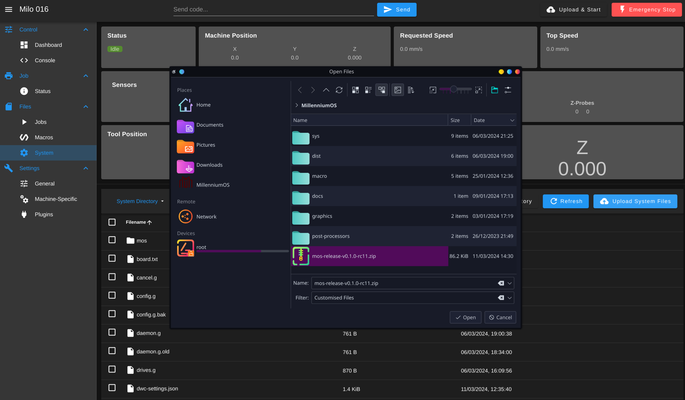
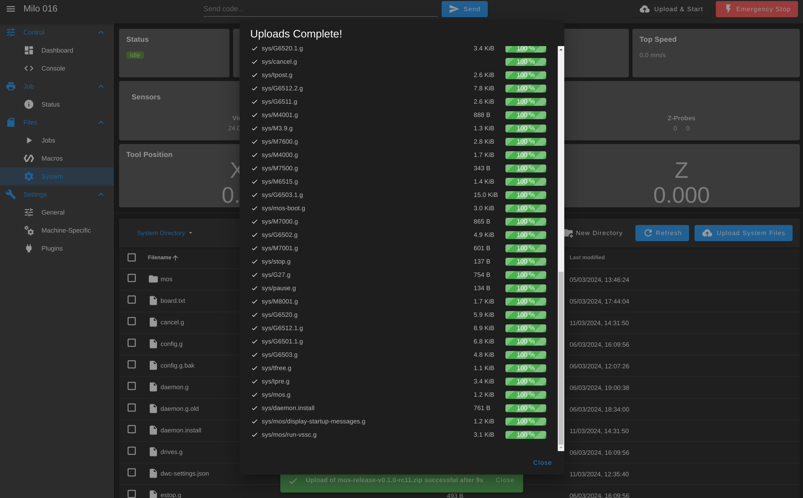
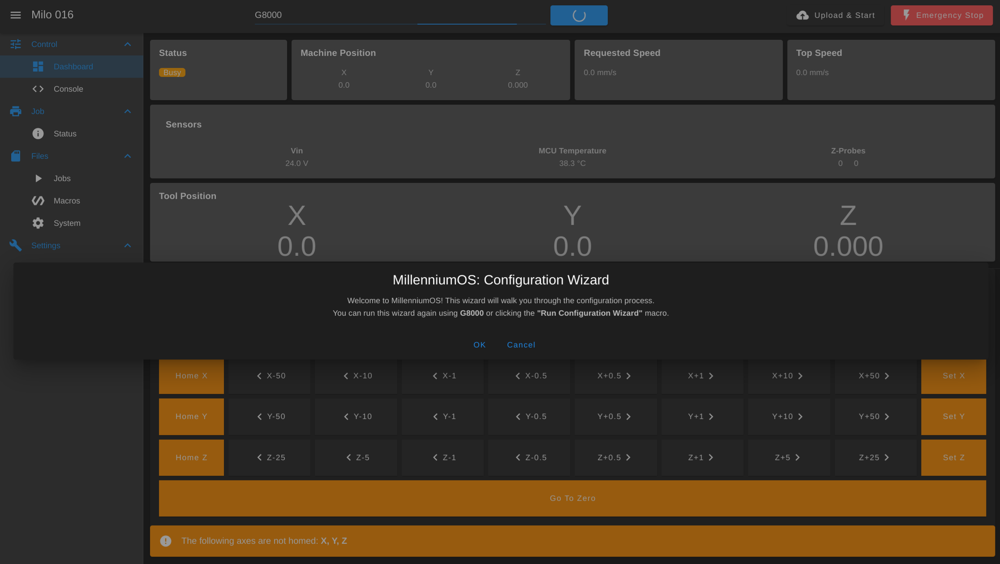
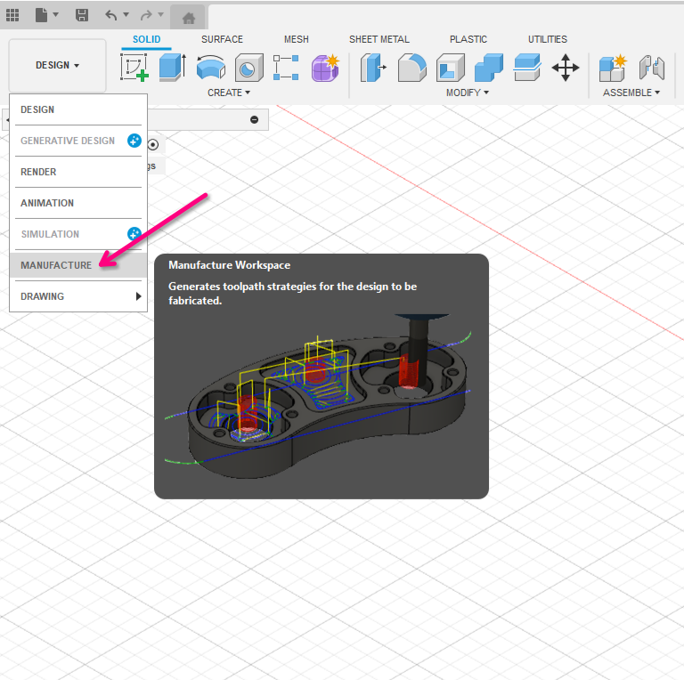
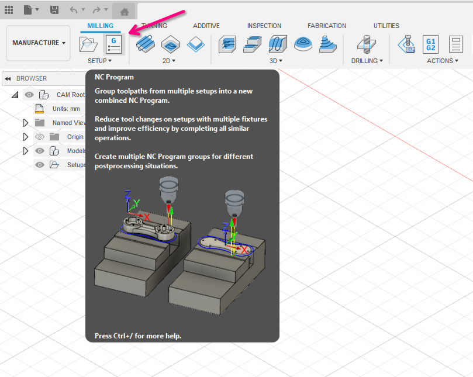
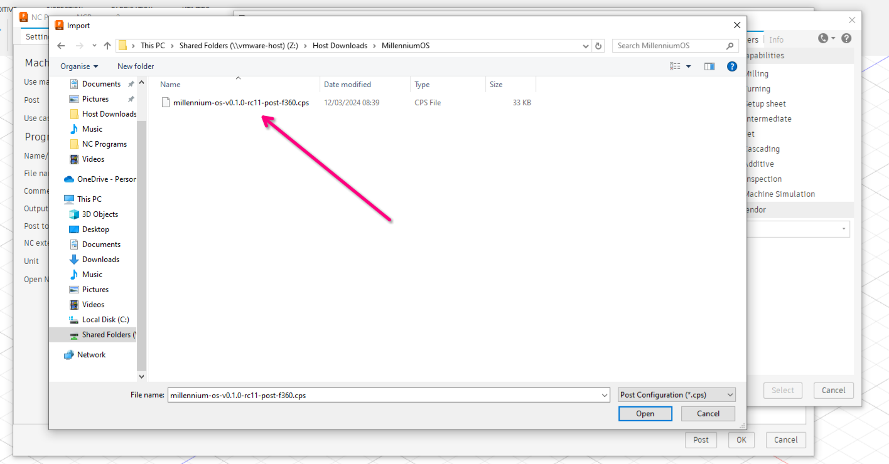
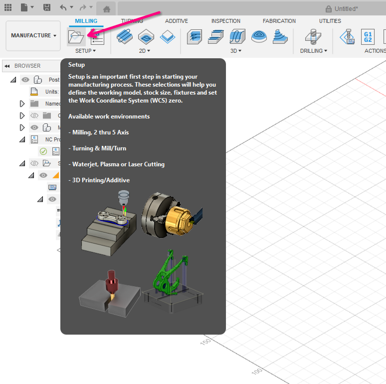
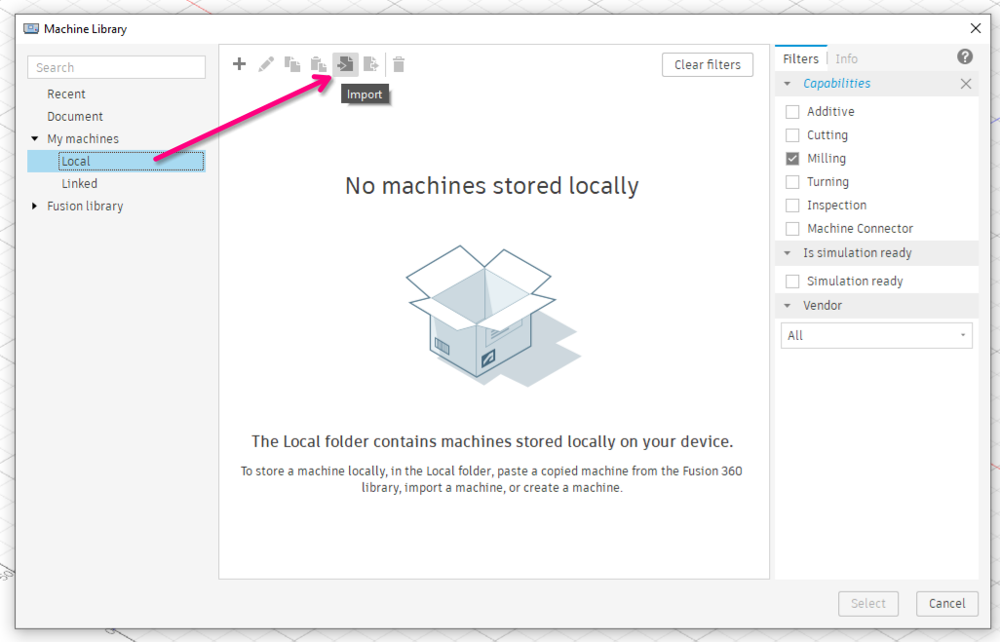
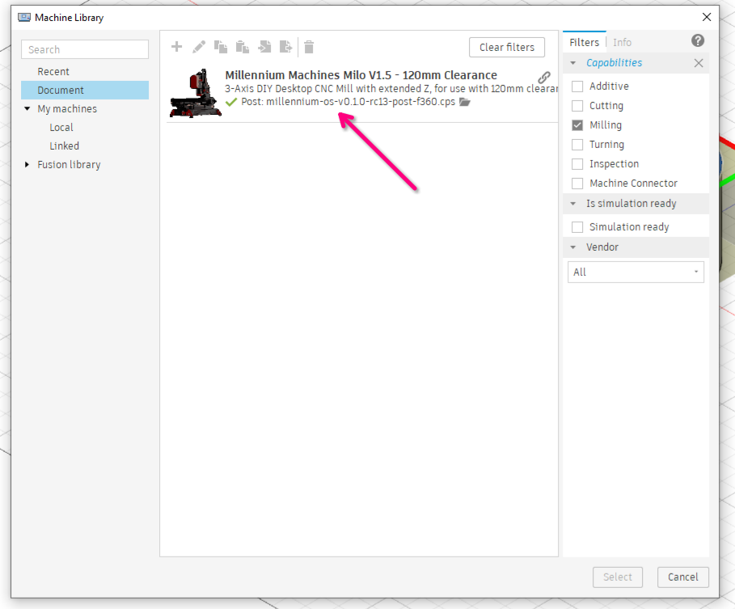

# Installing MillenniumOS

## What and Why?

MillenniumOS is an addon for RRF **3.5+** which implements some high-level functionality around work-piece probing, tool changes and tool setting that aim to make Millennium Machines the simplest route for novice machinists to make their first cuts confidently and safely.

MillenniumOS provides post-processors for common CAD/CAM packages (currently Fusion360 and others that use the same .cps format), as well as implementing a gcode dialect that makes machining feel a little more like using a 3D printer - that is, the gcode generated by our post-processors is able to walk the operator through work-piece probing and tool changes that otherwise would be entirely manual or require significant implementation of custom macros to do safely.

MillenniumOS for RRF is distributed as a **single Zip file** that contains everything needed to understand and support our custom functionality and gcode dialect.

## RRF Installation

!!! note
    If you installed one of our [RRF Configurations](https://github.com/MillenniumMachines/RRF-Configs/releases) that contains MillenniumOS, then you may not need to follow everything in this guide. If you start RRF and a MillenniumOS configuration wizard appears, then MillenniumOS is already installed and just needs to be [configured](#configuration)!.

### Download MillenniumOS Release

MillenniumOS releases can be found on the [MillenniumOS Releases](https://github.com/MillenniumMachines/MillenniumOS/releases) page. Select the `mos-release-vX.X.X...zip` file to download the latest release.

{: .shadow-dark }

---

### Upload MillenniumOS files to RepRapFirmware

Once the Zip file has been downloaded, you can simply upload it to DWC using the **"Files -> System"** tab. Click **"Upload System Files"** (at the top right of the list of files), select the Zip file you downloaded previously (`mos-release-vX.X.X...zip`) and click OK.

{: .shadow-dark }

---

Each of the files from the Zip will be uploaded individually. You can see the list of files being uploaded and there will be a notification when the whole Zip file has been uploaded. Once the upload is complete, click **"Close""*.

{: .shadow-dark }

---

### Load MillenniumOS on startup

MillenniumOS needs to be loaded on every bootup of your mainboard. To achieve this, we need to add or uncomment a configuration line in your `config.g` file. Navigate to the **"Files -> System"** tab, and click on the `config.g` file to edit it.

Scroll to the bottom, and make sure that the last line in the file looks exactly like this:

```gcode
M98 P"mos.g"
```

If the line is commented - `; M98 P"mos.g"` or `(M98 P"mos.g")` - then remove the comment characters `;` or `(`..`)` from the line to load MillenniumOS on startup.

Once done, click the Save button in the top right.

!!! warning
    As you have changed `config.g`, you may be prompted to **restart** or **reload** the RRF configuration. Pick the **restart** option.

    If you are not prompted, please type `M999` in the **"Control -> Console"** tab and hit enter to restart the mainboard.
    MillenniumOS will not load properly until the machine is restarted.

### Configuration

After restarting, you will be prompted to configure MillenniumOS. This configuration process is guided, so simply read and click through the dialog boxes as they appear.

{: .shadow-dark }

---

When prompted to provide information or perform an action, please read the information *carefully* - the configuration wizard will trigger movement of the machine where necessary, but you will *always* be warned before this happens.

If you cancel the wizard, or receive an error, you can re-run the wizard using `G8000`. Once the wizard is complete your machine will reboot to reload the new settings, at which point MillenniumOS is ready for use.

!!! note
    If you experience any connection issues during the wizard, you can usually reload your browser tab to trigger the next dialog.

!!! warning
    If you receive any syntax errors or other errors during the configuration process, please report these on the [MillenniumOS](https://github.com/MillenniumMachines/MillenniumOS) repository as an issue or ask for assistance on our Discord.

---

## Post-Processor Installation

After configuring MillenniumOS, the final step is to install the post-processor and optionally (unless you want to use operation properties), a machine definition into your chosen CAD/CAM software so it can produce the right gcode for MillenniumOS.

Currently, only Fusion360 is supported with a `.cps` post-processor. This may work in other Autodesk products but usage outside of Fusion360 is completely untested and out of scope for this documentation.

### Fusion360 Post-Processor Installation

Download the `millennium-os-<version>-post-f360.cps` file from the release matching your installed MillenniumOS version.

{: .shadow-dark }

---

### Fusion360 Machine Definition Installation

You should generally also install Fusion360 machine definition as this allows you to configure the post-processor on a per-operation basis for certain settings. These are released alongside the post-processor and RRF Zip file.

You will need to download the file that matches your machine specification - currently these are generated for the following specifications:

* Standard: `milo-v1.5-std-v...mch`
    * X=0 to 335mm
    * Y=0 to 208mm
    * Z=0 to -120mm

This can be used with a machine of the standard working area, with either a 60mm or 120mm clearance. This includes the LDO kit.

!!! note
    Refer to the image in the [Post-Processor Installation](#post-processor-installation) section for how these appear on each release.

---

#### Creating an NC Program

Switch to the **"MANUFACTURE"** workbench in Fusion360.

{: .shadow }

---

Under the **"Milling"** tab in the top bar, click the **"NC Program"** icon (the one with a G at the top of a document).

{: .shadow }

---

#### Importing the post-processor

Click the **"Folder"** icon to the right of Post (**"Select post from the library"**).

{: .shadow }

---

Hit the **"Import"** button (Document with Arrow on the left, facing right).

{: .shadow }

---

Select the `millennium-os-...-f360.cps` file from your filesystem and click "Open" in the bottom right of the window.

{: .shadow }

---

Make sure the newly created "MillenniumOS" post entry is selected in the Post Library and click Select in the bottom right of the window.

{: .shadow }

---

You may now click "OK" on the "NC Program" window to return to the main view.

#### Creating a Setup

To install the machine definition, we must first create a **"Setup"**. Click on the **"Setup"** icon under the **"Milling"** tab in the top bar.

{: .shadow }

---

Click **"Select"** on the **"Setup"** tab under the **"Machine"** heading:

{: .shadow }

---

#### Import the machine definition

Click on the **"Import"** button to open the machine definition selection dialog:

{: .shadow }

---

Click **"Select from my computer"** in the bottom left hand corner of the selection window, and then pick the `.mch` file you downloaded previously.

{: .shadow }

---

!!! note
    The machine file and post-processor are configured and named specifically so that they reference each other. You should load the machine definition after the post-processor, allowing it to find the post-processor file. When successfully linked, you should see a `Post` line under the machine definition indicating that the Machine and post-processor are linked.

{:.shadow }

---

### Configure the post-processor

Configure the post-processor in the **"Post properties"** section of the **"NC Program"** window to your liking. The default settings should work fine unless you have more advanced needs.

{: .shadow }

---

You're now ready to add some toolpaths and then run the post to generate MillenniumOS flavoured output gcode. These steps are not MillenniumOS specific, and are therefore outside of the scope of this documentation.

If you would like to understand how MillenniumOS works in practice and how best to use it, please proceed to the next chapter.

[Next Chapter: Using MillenniumOS](./usage.md)


*[WCS]: Work Co-ordinate System
*[RRF]: RepRapFirmware
*[DWC]: Duet Web Control